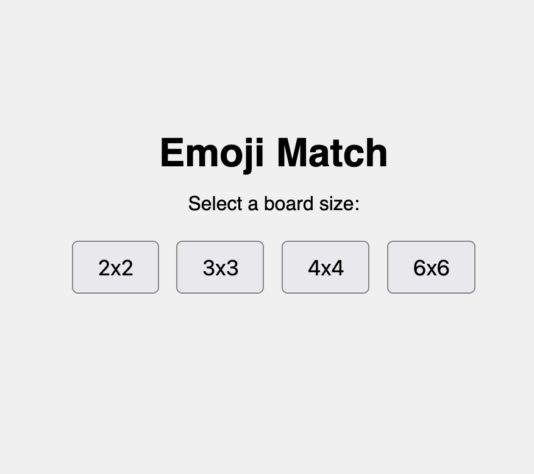
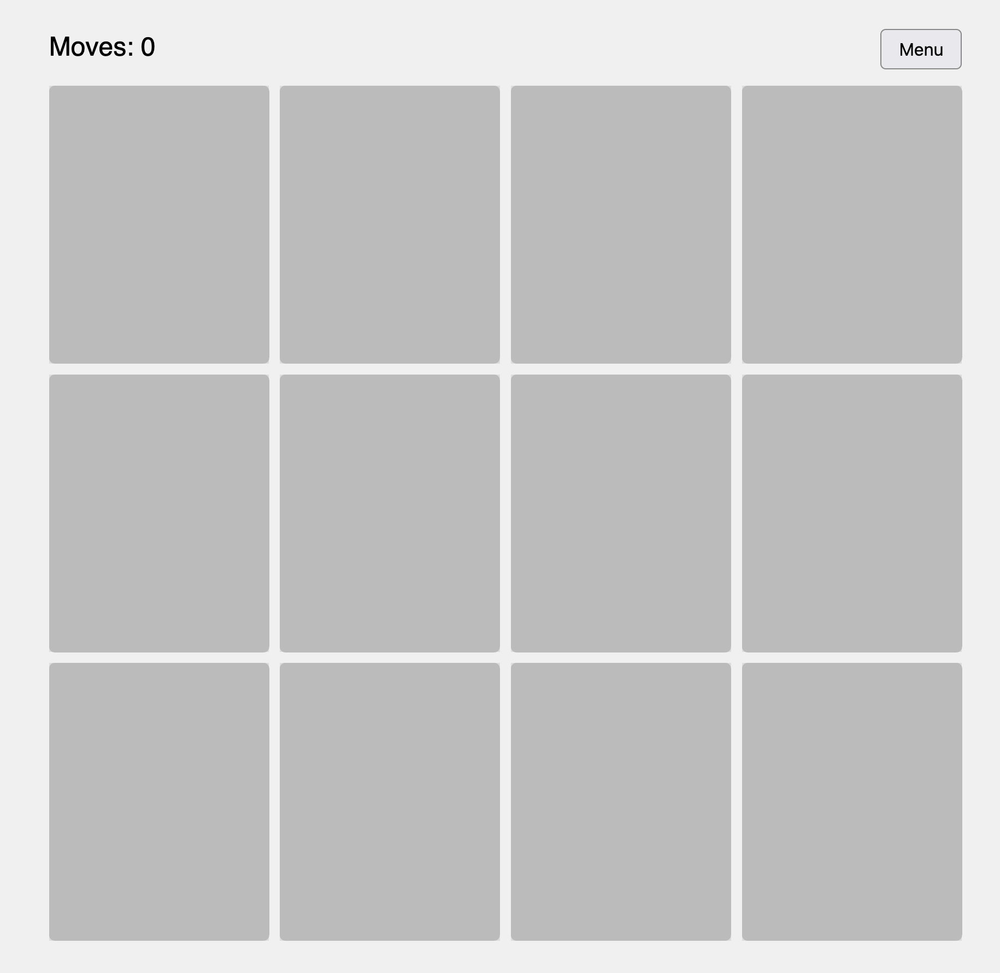
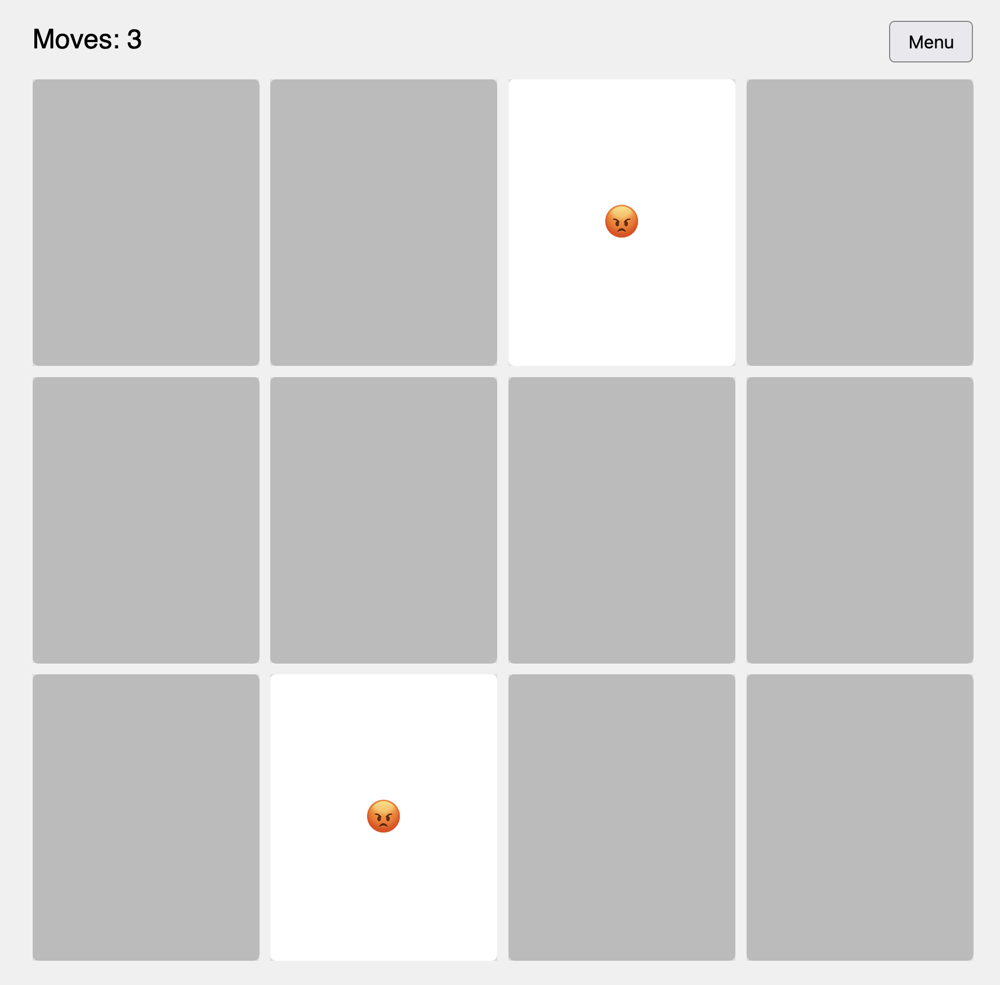

# Emoji Match

A 100% vibe coded super simple emoji match memory game.

## Getting Started

To get started with Emoji Match, follow these simple steps.

### Prerequisites

Make sure you have the following installed on your system:

- **Go**: [Download and install Go](https://golang.org/dl/)
- **Node.js & npm**: [Download and install Node.js and npm](https://nodejs.org/en/download/)

### Building the Application

To build the application, run the following command in your terminal:

```bash
make build
```

This command will build the Go backend and the frontend assets, creating a binary named `emoji-match` in the root directory.

### Running the Application

Once the build is complete, you can start the application by running the following command:

```bash
./emoji-match
```

This will start the web server, and you can access the game in your browser at [http://localhost:3001](http://localhost:3001).

## Screenshots


**Board size selection**


**A fresh board**


**A board with a match**
